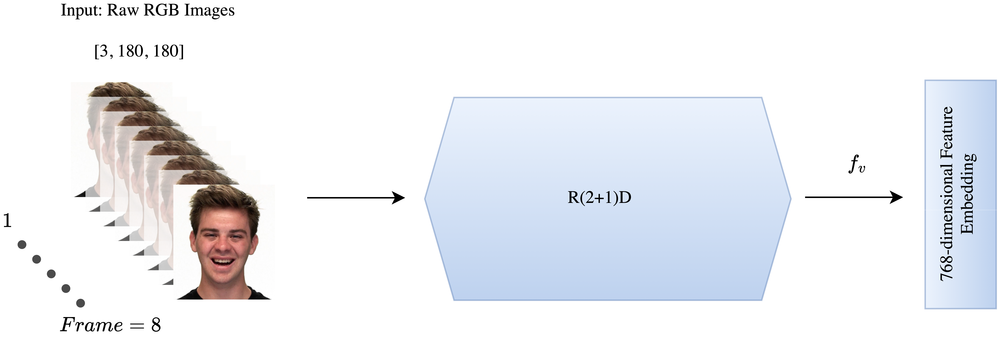

# Multi-Microphone & Multi-Modal Emotion Recognition in Reverberant Environments

🚀 **Official repository for the paper:**  
**"Multi-Microphone and Multi-Modal Emotion Recognition in Reverberant Environments"**  
This work is an extension of our previous paper "Multi-Microphone Speech Emotion Recognition using the Hierarchical Token-semantic Audio Transformer
Architecture", incorporating multi-modal learning to further improve robustness.  
📄 [Read the Paper](https://arxiv.org/pdf/2409.09545)  
🔗 [Dataset & Pretrained Models](LINK_TO_DATA_MODELS)

---

## 🔍 Overview
Human emotions are conveyed through **speech and facial expressions**, making **multi-modal emotion recognition (MER)** crucial for robust emotion classification. This work introduces a **multi-microphone, multi-modal system** combining:

- **HTS-AT Transformer** for multi-channel audio processing
- **R(2+1)D ResNet CNN** for video-based emotion recognition
- **Late fusion concatenation** to combine audio & video features

### 🔮 Key Features
✔️ **Multi-Microphone Audio Processing**: Robust against reverberation  
✔️ **Multi-Modal Learning**: Combines speech and facial cues  
✔️ **Tested on RAVDESS with Real-World RIRs** (ACE Database)  
✔️ **Pretrained Models Available** for Fine-Tuning and testing

---

## 📊 Model Architecture
Our approach consists of **two main components**:
1. **HTS-AT Transformer (Audio Modality)**:
   - Processes **multi-channel mel-spectrograms**
   - Uses **Patch-Embed Summation & Averaging strategies**
   - Extracts **deep features** for robust emotion classification
2. **R(2+1)D CNN (Video Modality)**:
   - Extracts spatiotemporal features from facial expressions
   - Pretrained on **Kinetics dataset**, fine-tuned for MER
3. **Feature Fusion & Classification**:
   - Late fusion via **concatenation of extracted embeddings**
   - Fully connected layers for final emotion classification

| Multi-channel Multi-modal Architecture | Multi-Microphone Audio | Video-Based Recognition |
|----------------------|------------------|----------------------|
|  |  |  |

---

## 🔧 Getting Started

### **1️⃣ Installation**
The base way to run the code is with Docker Container.
#### **Pull Docker Image**
```bash
docker pull ohadico97/mer:v1
```
#### **Clone the Repository**
```bash
git clone https://github.com/yourusername/Multi-Modal-SER.git
cd Multi-Modal-SER
```
#### **Use the Virtual Environment**
```bash
Python 3.8.13 ('base')
```

---

### **2️⃣ Dataset Setup**


The previous paper evaluated the model on three datasets: **RAVDESS**, **IEMOCAP**, and **CREMA-D**. In this work, we focus exclusively on the **RAVDESS** dataset. The **training and validation splits** are reverberated synthetically using the **'gpuRIR' Python library**, while the **test sets** are reverberated with real-world ACE RIRs recorded in various acoustic environments. You can choose which modality to fine-tune using the ```bash multimodal``` flag in ```bash config.py```.
- **RAVDESS**: [Download Here](https://zenodo.org/record/1188976)
- **ACE RIRs**: [Download Here](https://www.ace-challenge.org)

Place datasets inside `data/` folder:
```bash
mkdir data && mv RAVDESS data/
```

---

### **3️⃣ Training & Evaluation**
#### **Preprocess Data**
```bash
python src/preprocess.py --dataset ravdess --rir_data ACE
```
#### **Train the Multi-Modal Model**
```bash
python train.py --dataset ravdess --epochs 150 --batch_size 64
```
#### **Evaluate Performance**
```bash
python evaluate.py --dataset ravdess --rir_data ACE
```

---

## 📊 Results
| Model | RAVDESS (Clean) | RAVDESS (Reverberant) |
|----------------------|--------|--------|
| Single-Channel HTS-AT | 77.3% | 61.3% |
| Multi-Channel HTS-AT (Sum PE) | 85.3% | 68.7% |
| **Multi-Modal (HTS-AT + R(2+1)D)** | **90.0%** | **75.5%** |

---

## 🏆 Citation
If you use this work, please cite:
```bibtex
@inproceedings{cohen2025multimodal,
  author    = {Ohad Cohen, Gershon Hazan, Sharon Gannot},
  title     = {Multi-Microphone and Multi-Modal Emotion Recognition in Reverberant Environments},
  booktitle = {ICASSP},
  year      = {2025}
}
```

---

## 🌟 Acknowledgments
This research was supported by the **European Union’s Horizon 2020 Program** and the **Audition Project, Data Science Program, Israel**.

---

## 👤 Contact
For questions or collaborations, feel free to reach out:  
📧 **ohad.cohen@biu.ac.il**

